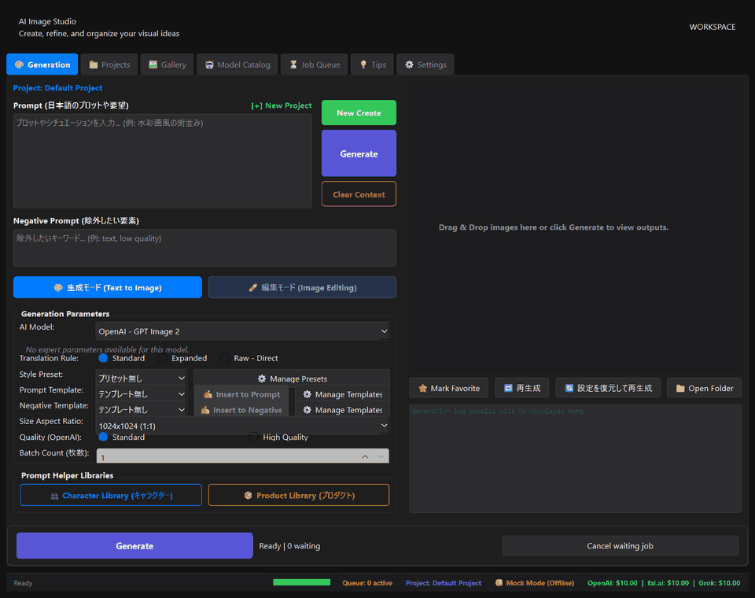
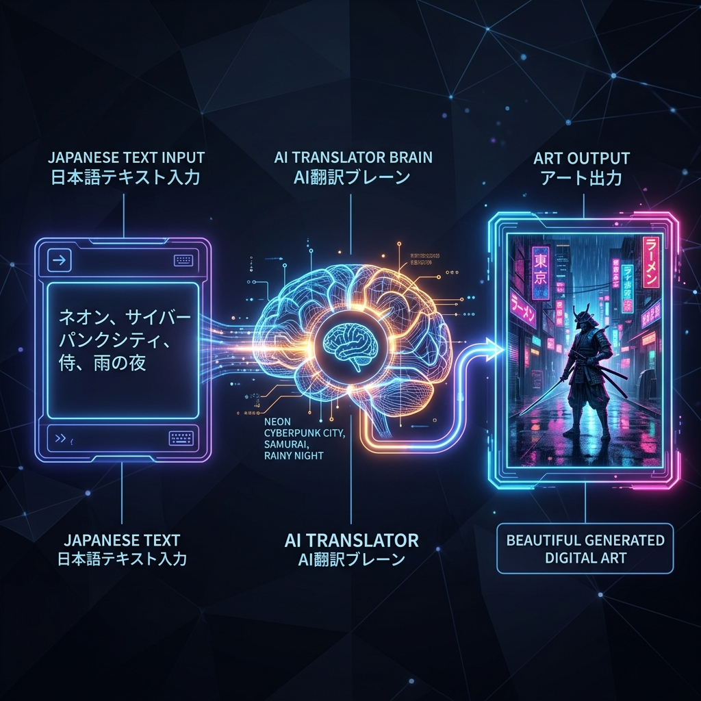

<div align="center">


# 🎨 GPT Image Studio

### Turn an idea into a production-ready visual — without juggling five different AI dashboards.

[](https://github.com/Curren-Chan/AI-Image-Studio/actions/workflows/ci.yml)
[](LICENSE)
[](https://www.python.org/)
[](https://doc.qt.io/qtforpython-6/)
[](https://github.com/Curren-Chan/AI-Image-Studio/stargazers)

[Quick Start](#-quick-start) · [Features](#-key-features) · [日本語](#-日本語) · [Contributing](CONTRIBUTING.md)

</div>



> **Demo mode works without an API key.** Clone, install, and launch to explore the complete workflow with local placeholder images.

## ⚡ Why this?

AI image workflows become fragmented fast: one tab for prompting, another for translation, several provider dashboards, and a pile of unnamed output files. GPT Image Studio brings that loop into one focused desktop workspace. Write naturally in Japanese or English, choose the best model for the job, tune only the controls you need, queue variations, and keep every result connected to its prompt and metadata.

## ✨ Key features

- 🌐 **One studio, multiple providers** — work with OpenAI, fal.ai, xAI, and HotAPI models through a consistent interface.
- 🧠 **Prompt translation built in** — turn Japanese ideas into generation-ready English with OpenAI or Gemini.
- 🎛️ **Simple when you want it, expert when you need it** — switch from friendly presets to model-specific parameters without changing tools.
- ⚡ **Background generation queue** — line up batches, follow progress, and keep exploring while jobs run.
- 🖼️ **A gallery that remembers** — preserve prompts, model details, dimensions, cost estimates, favorites, and generation context beside each image.
- ✏️ **Generate and edit workflows** — move between text-to-image and supported image-editing models in the same workspace.
- 🧩 **Reusable creative building blocks** — manage styles, positive/negative prompt templates, characters, products, and projects.
- 🔒 **Local-first project data** — keys stay in your local `.env`; databases, logs, settings, and generated images are excluded from Git by default.
- 🧪 **Useful without credentials** — automatic mock mode makes onboarding, UI evaluation, and contribution easier.

## 🎬 Visual workflow

<p align="center">
  
</p>

The GIF above is generated from the real application UI. To record a launch-ready version with your preferred model and footage, follow [`docs/visual_plan.md`](docs/visual_plan.md).

## 🚀 Quick Start

### Requirements

- Python **3.10 or newer**
- Windows, macOS, or Linux with a desktop environment
- An API key for at least one provider for real generation (optional for demo mode)

### 1. Clone and create an environment

```bash
git clone https://github.com/Curren-Chan/AI-Image-Studio.git
cd AI-Image-Studio
python -m venv .venv
```

Activate it:

```bash
# Windows PowerShell
.\.venv\Scripts\Activate.ps1

# macOS / Linux
source .venv/bin/activate
```

### 2. Install and launch

```bash
python -m pip install --upgrade pip
pip install -r requirements.txt
python main.py
```

No key yet? Keep the generated `.env` absent or empty. The app starts in mock mode so you can evaluate the full interface safely.

## 🔑 API key configuration

Copy the documented template and add only the providers you plan to use:

```bash
# Windows PowerShell
Copy-Item .env.example .env

# macOS / Linux
cp .env.example .env
```

```dotenv
OPENAI_API_KEY=your_openai_api_key_here
FAL_KEY=your_fal_api_key_here
GEMINI_API_KEY=your_gemini_api_key_here
XAI_API_KEY=your_xai_api_key_here
HOTAPI_KEY=your_hotapi_api_key_here
```

You can also enter keys from **Settings** inside the app. The resulting `.env` is ignored by Git. Never commit it, attach it to a bug report, or show it in a screen recording. Provider usage can incur charges; review the selected provider's pricing before generating.

## 📦 Release build

Install build dependencies and create a platform-native application bundle:

```bash
pip install -r requirements-dev.txt
pyinstaller --noconfirm --clean GPTImageStudio.spec
```

The bundle is written to `dist/GPTImageStudio/`. Test that folder on a clean machine, then archive the entire folder—not only the executable.

Tagged releases are automated for Windows, macOS, and Linux:

```bash
git tag v4.8.0
git push origin v4.8.0
```

The [release workflow](.github/workflows/release.yml) runs tests, builds each platform, creates archives, and attaches them to a GitHub Release. See [`docs/PUBLISHING_CHECKLIST.md`](docs/PUBLISHING_CHECKLIST.md) before the first public push.

## 🧪 Development

```bash
pip install -r requirements-dev.txt
python -m pytest -q
python scripts/security_check.py
```

The repository intentionally excludes credentials, runtime databases, local settings, logs, generated images, caches, and build artifacts. Security findings and the original cleanup inventory are documented in [`docs/SECURITY_AUDIT.md`](docs/SECURITY_AUDIT.md).

## 🗺️ Roadmap

- Provider capability auto-detection and richer cost previews
- Non-destructive image editing history
- Shareable workflow presets
- Optional local model adapters
- Signed installers and automatic update checks

Have an idea? Start a [Discussion](https://github.com/Curren-Chan/AI-Image-Studio/discussions) or open a focused issue.

## 🇯🇵 日本語

GPT Image Studio は、複数の画像生成AI、プロンプト翻訳、詳細パラメータ、バックグラウンドキュー、作品管理をひとつに統合したデスクトップアプリです。日本語でアイデアを書き、モデルを選び、生成結果と設定をまとめて管理できます。

最短の起動手順は次のとおりです。

```powershell
python -m venv .venv
.\.venv\Scripts\Activate.ps1
pip install -r requirements.txt
Copy-Item .env.example .env
python main.py
```

APIキーを設定しなくてもモックモードでUIと基本フローを試せます。詳しい操作方法は [`USER_GUIDE.md`](USER_GUIDE.md) を参照してください。

## 🤝 Contributing

Bug reports, provider integrations, UX improvements, translations, and documentation fixes are welcome. Read [`CONTRIBUTING.md`](CONTRIBUTING.md), then open a small, focused pull request.

## 🔐 Security

Please do not report credential leaks or exploitable vulnerabilities in public issues. Follow the private reporting process in [`SECURITY.md`](SECURITY.md).

## 📄 License

Released under the [MIT License](LICENSE).

<div align="center">

**If this makes your creative loop faster, consider starring the repository. ⭐**

</div>
