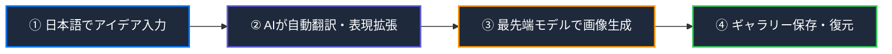

# AI Image Studio (Ver3.2.0) ユーザーズマニュアル

**AI Image Studio** は、OpenAI、fal.ai、xAI (Grok) などの最先端のAI画像生成モデルと、日本語から英語への高精度なプロンプト翻訳・拡張エンジンを組み合わせた、オールインワンのデスクトップ画像生成スタジオです。

初めて使用する方でも直感的に操作でき、高品質な画像を作成できるように設計されています。

---

## 🚀 生成の流れ (Workflow)

> [!NOTE]
> **セーフティフィルター回避機能搭載**: 
> 従来の画像生成AIでは「セクシー」や「露出」などの表現はフィルターで拒否されることがありますが、本ツールのAI翻訳エンジンはこれらを「エレガントな光と影」「芸術的な衣類のドレープ」といった芸術的・文学的な英語表現へ自動で変換し、エラーを回避します。

---

## 🖥️ 画面構成 (GUI Layout)

アプリケーションは、使いやすさを追求した**プレミアム・ダークテーマ**の1画面構成になっています。大きく分けて以下の4つのエリアで構成されています。

| エリア名 | 主な役割・機能 |
| :--- | :--- |
| **① プロンプト＆設定エリア** | プロンプト入力、生成/編集モード切り替え、AIモデル選択、テンプレート挿入、枚数設定 |
| **② プレビューエリア** | 生成された画像の最大表示、お気に入り追加、リテイク（再生成）、フォルダを開く |
| **③ ギャラリー＆詳細エリア** | 過去の生成履歴一覧、選択した画像のメタデータ詳細表示、過去のコンテキスト復元 |
| **④ ステータスバー（最下部）** | 生成の進捗インジケータ、シミュレートされた各APIの残高表示、Tipsタブ |

---

## 📘 基本の使い方（最初の一枚を生成する）

アプリを起動したら、以下の3ステップで簡単に画像を生成できます。

### Step 1: アイデア（プロンプト）を入力する
左上の「**Prompt**」テキストエリアに、作成したい画像のイメージを日本語で入力します。
* 例：`水彩画風の美しい中世ヨーロッパの街並み、夕暮れ、優しい色合い`

### Step 2: AIモデルを選択する
「**Generation Parameters**」の中の「**AI Model**」から、使用したいモデルを選択します。
* **OpenAI DALL-E 3**: 最も指示通りに安定した描画をしてくれるモデル。
* **FLUX.2 (fal.ai)**: 最新のリアルかつ美麗な描画、文字入れが得意なモデル。
* **Grok 2 (xAI/fal.ai)**: 芸術的で多様なタッチに対応するモデル。

### Step 3: 生成（Generate）を実行する
右上の紫色の大きな「**Generate**」ボタンをクリックします。
* 翻訳と画像生成が始まり、下部の進捗バーが「Now Generating...」と点滅します。
* 生成が完了すると、中央のプレビューエリアに画像が大きく表示され、同時に右下のギャラリー履歴に自動で追加されます。

---

## 💡 便利・応用機能

### 1. テンプレート機能（直挿入方式）
「**Prompt Template**」や「**Negative Template**」のドロップダウンメニューからスタイル（アニメ調、実写風、水彩画風など）を選択し、「**✍️ Insert to Prompt**」をクリックします。
* プロンプト欄に直接英語のスタイルキーワードが展開されます。
* 展開されたキーワードを編集して、自分だけのカスタムプロンプトにアレンジすることが可能です。

> [!TIP]
> **テンプレート管理**:
> 「⚙️ Manage Templates」ボタンを押すと、オリジナルのプロンプトや除外したいワード（ネガティブプロンプト）を自由に追加・編集・保存できます。

### 2. 編集（Image Editing）モード
すでに手元にある画像や、生成した画像をベースにして、一部を変更したりバリエーションを作ったりするモードです。
1. **画像をプレビューエリアにドラッグ＆ドロップ**するか、ギャラリーから選択します。
2. 生成モードセグメントを「**✏️ 編集モード (Image Editing)**」に切り替えます。
3. プロンプト欄に変更内容を入力して「**Generate**」を押します。

### 3. コンテキストのロード（過去の設定の復元）
ギャラリー履歴から画像を選択し、詳細欄にある「**Load Context (入力に反映)**」ボタンをクリックします。
* その画像を生成したときの**「日本語プロンプト」「英語プロンプト」「アスペクト比」「除外ワード」「AIモデル」**がすべて自動で入力欄に復元されます。
* 少しだけ条件を変えて再生成したい場合に非常に便利です。

### 4. 👥 Character & 📦 Product Library
プロンプトヘルパーライブラリを使用すると、よく使うキャラクターの特徴や、商品の構図・アングルをワンクリックでプロンプトに呼び出せます。
* キャラクターの髪型、服装、ポーズなどの一貫性を保つのに最適です。

---

## 💰 リアルタイム残高シミュレータ

画面の最下部には、使用したAPIプロバイダー別の**シミュレートされた残高**がリアルタイムで表示されます。
* **OpenAI / fal.ai / Grok** それぞれの残高が、テキスト翻訳および画像生成にかかった見積もりコストに基づいて自動で減算されていきます。
* 残高の初期値やAPIキーの設定は、メニューバーの「**Settings**」から変更できます。

---

## ⚠️ 困ったときは (FAQ)

> [!WARNING]
> **API Error が発生する場合**
> * APIキーが正しく設定されているか「Settings」画面を確認してください。
> * OpenAIの残高が不足しているか、無料利用枠の期限が切れている可能性があります。
> * インターネットの接続状態を確認してください。
